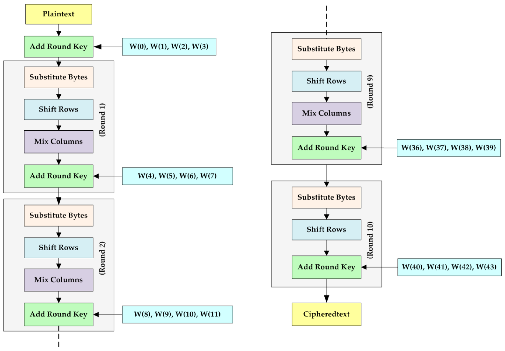

# AES-Advanced Encryption Standard (Python Implementation)



<p align="center">
A clean and educational implementation of the AES block cipher in Python 3, supporting 128-bit, 192-bit, and 256-bit encryption.
</p>

---

## 🔒 What Is This?

This repository contains a **pure-Python implementation of the AES encryption algorithm**, built for:

* Cryptography education
* Academic projects
* Security research
* Reference implementation (no external crypto libraries)

It supports:

* **AES-128 (10 rounds)**
* **AES-192 (12 rounds)**
* **AES-256 (14 rounds)**

---

## 🚀 Features
```
✔ Pure Python, no external crypto libs
✔ Supports 3 AES key sizes
✔ Symmetric block encryption (ECB)
✔ Easily modifiable & extensible
✔ Includes test input/output files
✔ Jupyter notebook for exploration
```
---

## 📦 Installation

```bash
pip install -r requirements.txt
```

> Works with Python **3.8+**

---

## 🧪 Run Tests / Example

```bash
python main.py
```

---

## 🛠 Usage Example

```python
from AES import AES

key = "<Enter 16, 24, or 32-byte key>"
rounds = 10     # AES-128 → 10
                # AES-192 → 12
                # AES-256 → 14

text = "<Enter plaintext>"

aes = AES(key, rounds)
```

### 🔐 Encrypt

```python
encrypted = aes.encrypt(text)
print(encrypted)
```

### 🔓 Decrypt

```python
decrypted = aes.decrypt(encrypted)
print(decrypted)
```

---

## 📁 Repository Structure

```
AES.ipynb          → Interactive notebook
AES.py             → Core AES implementation
main.py            → Example + test runner
in.txt             → Example plaintext input
out.txt            → Example encrypted output
requirements.txt   → Required dependencies
README.md          → This file
img/               → Diagrams & visual assets
```

---

## 📚 References

1. **Advanced Encryption Standard (AES)**
   [https://en.wikipedia.org/wiki/Advanced_Encryption_Standard](https://en.wikipedia.org/wiki/Advanced_Encryption_Standard)

---

## 📜 License

This project is open-source under the **MIT License**.
You are free to use, modify, and distribute it.

---

## 👤 Author

**Mohammad Alaei**
Mohammad Alaei AI Researcher & Computer Engineer 
🔗 Website: [https://alaeimo.ir](https://alaeimo.ir)
🔗 GitHub: [https://github.com/alaeimo](https://github.com/alaeimo)
